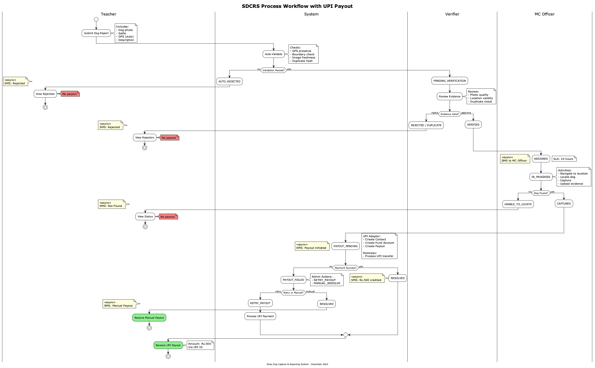
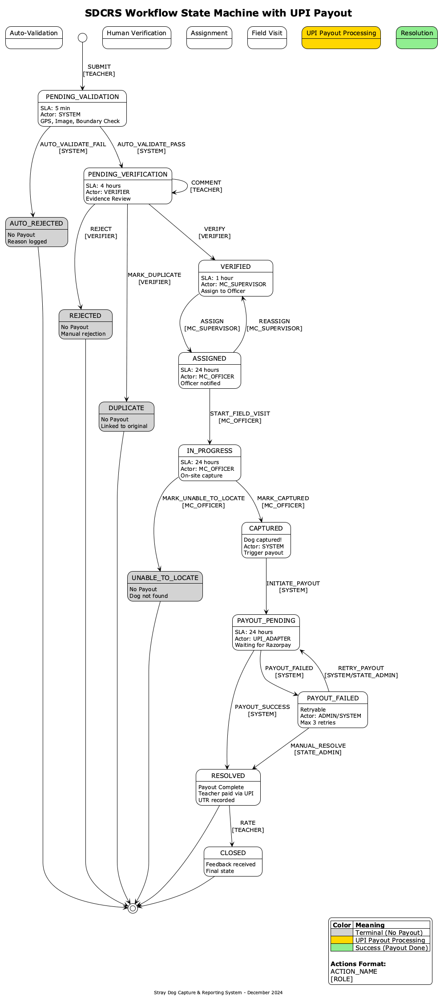
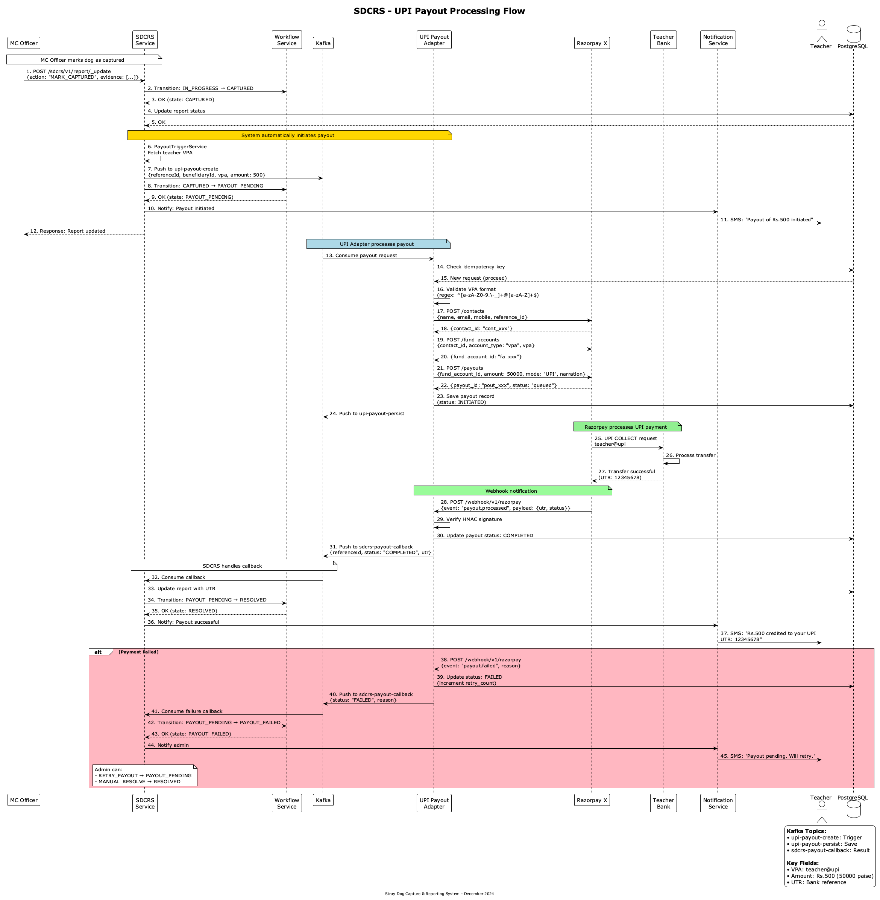

# Design Output #1: Process Workflow (with UPI Payout)

## SDCRS - Stray Dog Capture & Reporting System

---

## Overview

This document captures the end-to-end process workflow for the Stray Dog Capture & Reporting System with **UPI-based payout processing**.

**Key Business Rule:** Teachers receive payout via UPI ONLY after Municipal Corporation successfully captures/resolves the reported dog.

---

## Process Workflow Diagrams

### Swimlane Diagram (with UPI Payout)



### State Machine Diagram



### UPI Payout Sequence Diagram



---

## Swimlanes & Roles

| Lane | Role | Description |
|------|------|-------------|
| **Teacher** | Reporter | Submits stray dog sighting applications, views status updates, receives UPI payouts |
| **System** | Automated | Validates submissions, routes to queues, triggers UPI payouts, sends automated notifications |
| **Verifier** | Backend Operator | Reviews evidence, compares duplicates, approves/rejects applications |
| **MC Officer** | Municipal Corporation | Views verified applications, conducts field visits, marks outcomes |
| **UPI Adapter** | Payment Service | Creates contacts/fund accounts in Razorpay, initiates UPI payouts |
| **Razorpay** | Payment Provider | Processes UPI transfers, sends webhook callbacks |

---

## Process Flow Description

### 1. Submission Phase (Teacher → System)

1. **Teacher** starts the process and submits an application with:
   - Photo of stray dog
   - Selfie at the location
   - GPS coordinates (auto-captured)

2. **System** validates the submission:
   - GPS presence and authenticity
   - GPS within valid tenant boundary (using `egov-location` service)
   - Timestamp within 48 hours
   - Image hash computation for duplicate detection

### 2. Validation Decision (System)

| Outcome | Path |
|---------|------|
| **Invalid** (missing GPS, outside boundary, old timestamp, duplicate image) | Auto Reject → System sends notification → Teacher views updated status |
| **Valid** | Route to Verification Queue → Verifier review |

### 3. Verification Phase (Verifier)

1. **Verifier** reviews evidence and compares with potential duplicates
2. Decision gateway:

| Decision | Path |
|----------|------|
| **Approve** | Approve Application → Route to MC Queue |
| **Reject/Duplicate** | Reject → Verifier sends notification → Teacher views updated status |

### 4. Field Action Phase (MC Officer)

1. **MC Officer** views verified applications in their jurisdiction
2. Conducts field visit and takes action
3. Outcome gateway:

| Outcome | Path |
|---------|------|
| **Success** | Mark Captured → System triggers UPI payout |
| **Failure** | Mark Unable to Locate → NO PAYOUT |

### 5. UPI Payout Phase (NEW)

1. **System** receives CAPTURED status and triggers payout via Kafka
2. **UPI Adapter** consumes payout request:
   - Creates Contact in Razorpay (if new)
   - Creates Fund Account (VPA)
   - Creates Payout

3. **Razorpay** processes UPI payment:
   - Real-time transfer to teacher's VPA
   - Webhook callback on completion/failure

4. **UPI Adapter** receives webhook:
   - Verifies signature
   - Pushes result to SDCRS callback topic

5. **System** handles callback:
   - **SUCCESS**: Transition to RESOLVED, notify teacher
   - **FAILED**: Transition to PAYOUT_FAILED, allow retry

---

## Status States (with UPI)

| Status | Description | Trigger |
|--------|-------------|---------|
| `PENDING_VALIDATION` | Awaiting system validation | Submission received |
| `AUTO_REJECTED` | Rejected by system | Failed auto-validation |
| `PENDING_VERIFICATION` | In verifier queue | Passed auto-validation |
| `VERIFIED` | Approved by verifier | Verifier approval |
| `REJECTED` | Rejected by verifier | Manual rejection |
| `DUPLICATE` | Marked as duplicate | Verifier action |
| `ASSIGNED` | Assigned to MC Officer | Supervisor assignment |
| `IN_PROGRESS` | MC Officer conducting field visit | MC starts visit |
| `CAPTURED` | Dog successfully captured | MC marks success |
| `PAYOUT_PENDING` | **UPI payout in progress** | System initiates payout |
| `PAYOUT_FAILED` | **UPI payment failed** | Razorpay failure callback |
| `RESOLVED` | Dog captured, payout complete | UPI success callback |
| `CLOSED` | Final state with feedback | Teacher rates |
| `UNABLE_TO_LOCATE` | Dog not found | MC marks failure |

---

## UPI Payout States Detail

### PAYOUT_PENDING

- **Actor**: UPI_ADAPTER, SYSTEM
- **SLA**: 24 hours
- **Description**: Payment is being processed by Razorpay
- **Transitions**:
  - `PAYOUT_SUCCESS` → RESOLVED (on successful UPI transfer)
  - `PAYOUT_FAILED` → PAYOUT_FAILED (on payment failure)

### PAYOUT_FAILED

- **Actor**: STATE_ADMIN, SYSTEM
- **Description**: UPI payment failed, can be retried
- **Failure Reasons**:
  - Invalid VPA
  - Bank account issue
  - Insufficient balance (provider)
  - Network timeout
- **Transitions**:
  - `RETRY_PAYOUT` → PAYOUT_PENDING (retry payment)
  - `MANUAL_RESOLVE` → RESOLVED (admin marks as paid offline)

---

## Kafka Topics

| Topic | Producer | Consumer | Purpose |
|-------|----------|----------|---------|
| `upi-payout-create` | SDCRS | UPI Adapter | Trigger payout |
| `upi-payout-status` | Webhook | UPI Adapter | Status processing |
| `upi-payout-persist` | UPI Adapter | Persister | Save payout records |
| `sdcrs-payout-callback` | UPI Adapter | SDCRS | Notify payout result |

---

## Payout Trigger Rules

**Payout is triggered ONLY when:**
1. Application is verified by Verifier (approved)
2. AND MC Officer marks it as "CAPTURED"
3. AND monthly cap not exceeded

**No payout is issued for:**
- Auto-rejected submissions
- Verifier-rejected submissions
- Duplicate submissions
- "Unable to Locate" outcomes
- Monthly cap exceeded (₹5,000 limit)

---

## Terminal States Summary

| State | Payout? | Reason |
|-------|---------|--------|
| `AUTO_REJECTED` | No | Failed validation |
| `REJECTED` | No | Verifier rejection |
| `DUPLICATE` | No | Already reported |
| `UNABLE_TO_LOCATE` | No | Dog not found |
| `RESOLVED` | **Yes** (₹500) | Capture + UPI success |
| `CLOSED` | **Yes** (₹500) | With feedback |

---

## Source Files

| File | Purpose |
|------|---------|
| `06-workflow/SDCRS_Swimlane_UPI.puml` | Swimlane diagram source |
| `06-workflow/SDCRS_StateMachine_UPI.puml` | State machine diagram source |
| `05-sequence-diagrams/SDCRS_Payout_UPI.puml` | Sequence diagram source |
| `06-workflow/sdcrs-workflow-viz-upi.ts` | XState visualization |
| `assets/SDCRS_Swimlane_UPI.png` | Generated swimlane image |
| `assets/SDCRS_StateMachine_UPI.png` | Generated state machine image |
| `assets/SDCRS_Payout_UPI.png` | Generated sequence image |

---

## Visualization Tools

### XState Visualizer

Copy the contents of `06-workflow/sdcrs-workflow-viz-upi.ts` to:
**https://stately.ai/viz**

### PlantUML Generation

```bash
# Generate all PNG diagrams
plantuml -tpng 06-workflow/SDCRS_Swimlane_UPI.puml -o ../assets
plantuml -tpng 06-workflow/SDCRS_StateMachine_UPI.puml -o ../assets
plantuml -tpng 05-sequence-diagrams/SDCRS_Payout_UPI.puml -o ../assets
```

---

*Document Version: 2.0 (UPI Payout)*
*Last Updated: December 2025*
*Status: Updated*
