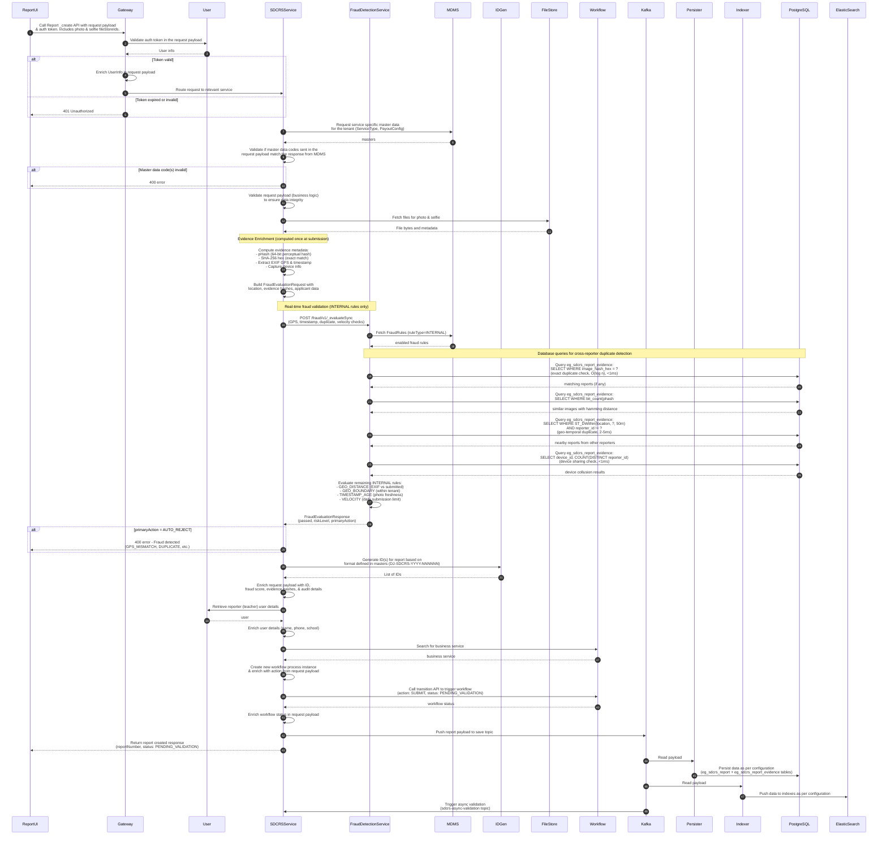
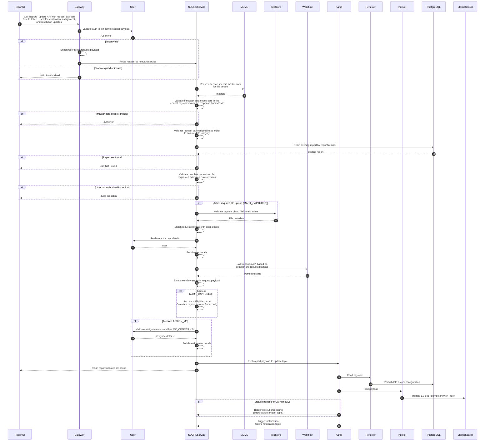
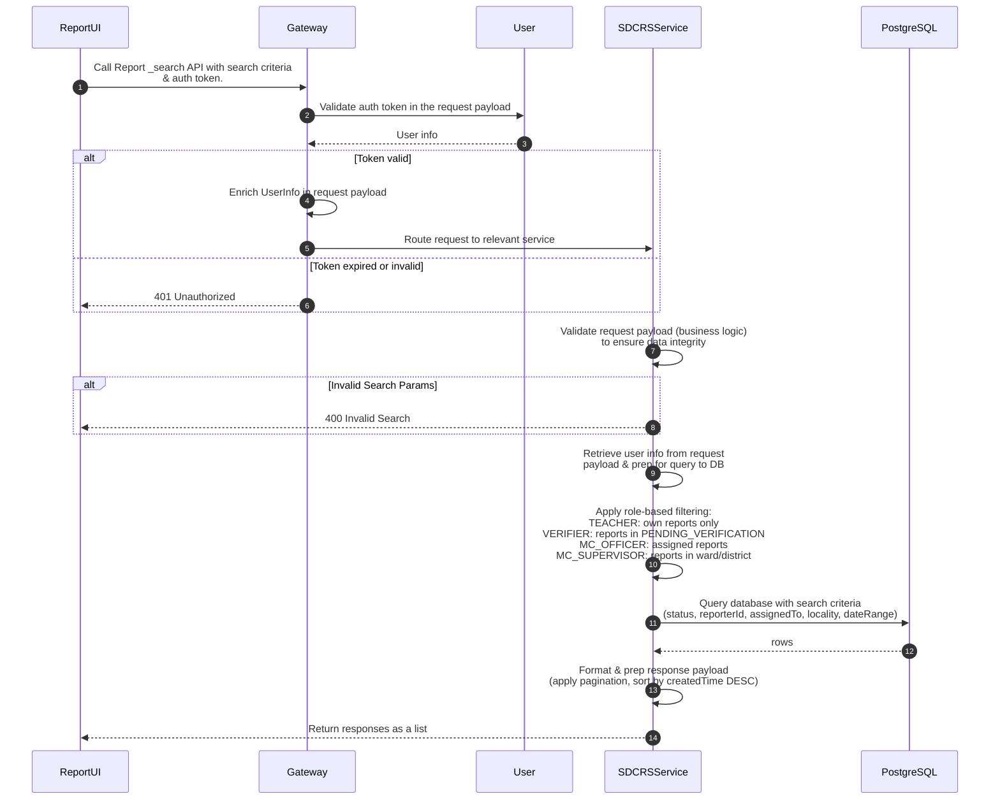
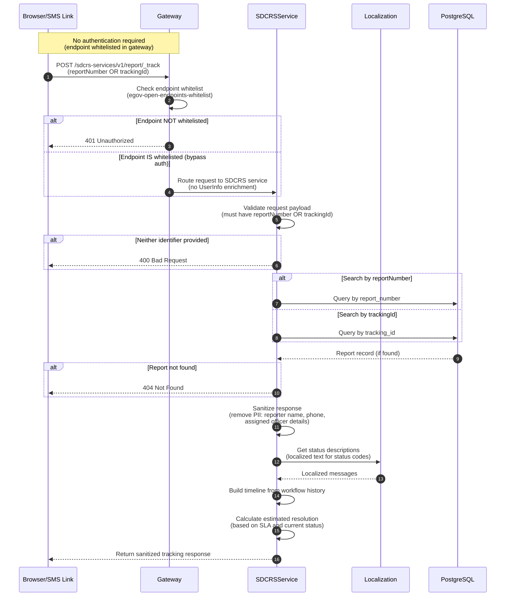
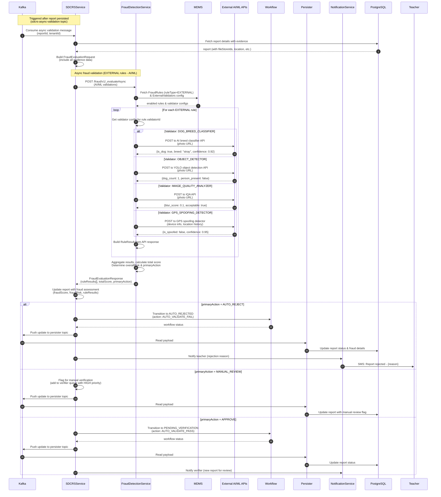
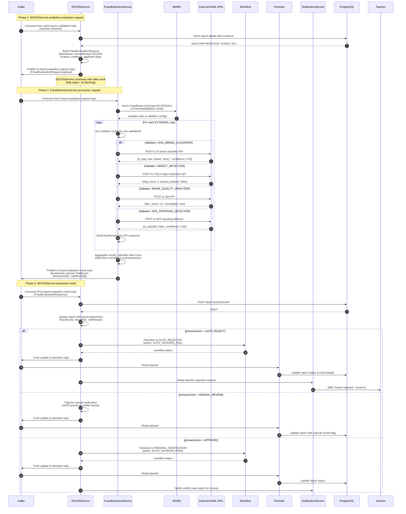
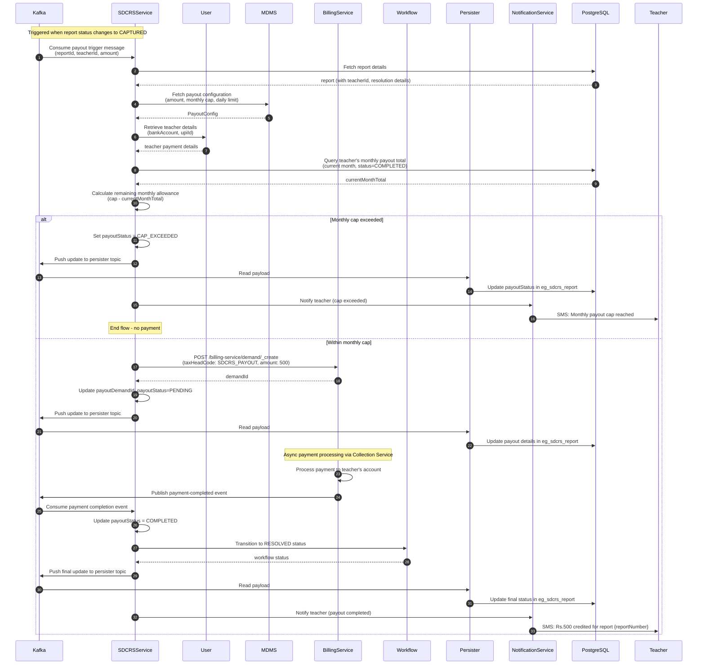

# SDCRS Design Output #5: Sequence Diagrams

This document contains sequence diagrams for the Stray Dog Capture & Reporting System (SDCRS), following the same pattern as [DIGIT Complaints Resolution System](https://docs.digit.org/complaints-resolution/design/architecture/sequence-diagrams).

## PlantUML Source Files

| Diagram | File | Description |
|---------|------|-------------|
| Create Report | [`SDCRS_Create.puml`](./05-sequence-diagrams/SDCRS_Create.puml) | Backend creation flow with sync fraud validation |
| Update Report | [`SDCRS_Update.puml`](./05-sequence-diagrams/SDCRS_Update.puml) | Update/workflow transition flow |
| Search Reports | [`SDCRS_Search.puml`](./05-sequence-diagrams/SDCRS_Search.puml) | Search flow |
| Track Report | [`SDCRS_Track.puml`](./05-sequence-diagrams/SDCRS_Track.puml) | Public tracking flow (anonymous access) |
| Async Fraud (HTTP) | [`SDCRS_AsyncValidation.puml`](./05-sequence-diagrams/SDCRS_AsyncValidation.puml) | AI/ML fraud detection via HTTP |
| Async Fraud (Kafka) | [`SDCRS_AsyncValidationKafka.puml`](./05-sequence-diagrams/SDCRS_AsyncValidationKafka.puml) | Event-driven fraud detection via Kafka |
| Payout Processing | [`SDCRS_Payout.puml`](./05-sequence-diagrams/SDCRS_Payout.puml) | Payout flow after capture |

---

## Create Report Flow



---

## Update Report Flow



---

## Search Reports Flow



---

## Track Report Flow (Public/Anonymous)



**Key Features:**
- **No Authentication Required**: Endpoint whitelisted in gateway (`egov-open-endpoints-whitelist`)
- **Dual Lookup**: Can search by `reportNumber` (DJ-SDCRS-2024-000123) or `trackingId` (ABC123)
- **PII Sanitization**: Response excludes reporter name, phone, and officer details
- **Localized Status**: Status descriptions fetched from Localization Service

---

## Async Fraud Validation Flow

This flow is triggered asynchronously after report creation to run AI/ML-based external validations.



**Key Features:**
- **Async Processing**: Runs after response returned to user (non-blocking)
- **External AI/ML Validators**: Calls configured external APIs from MDMS
- **Circuit Breaker**: FraudDetectionService uses Resilience4j for fault tolerance
- **Fallback Handling**: If external API fails, applies fallback action (SKIP_RULE, DEGRADE_TO_MANUAL)
- **Configurable Rules**: All rules loaded from MDMS (FRAUD-DETECTION/FraudRules.json)

---

## Async Fraud Validation Flow (Kafka Event-Driven)

This is an alternative fully event-driven pattern using Kafka for complete decoupling between SDCRSService and FraudDetectionService.



**Kafka Topics:**

| Topic | Producer | Consumer | Payload |
|-------|----------|----------|---------|
| `sdcrs-async-validation` | SDCRSService (after create) | SDCRSService | reportId, tenantId |
| `fraud-evaluation-request` | SDCRSService | FraudDetectionService | FraudEvaluationRequest |
| `fraud-evaluation-result` | FraudDetectionService | SDCRSService, other modules | FraudEvaluationResponse |

**Key Advantages of Kafka Pattern:**
- **Full Decoupling**: FraudDetectionService has no direct dependency on calling services
- **Multi-Consumer**: Multiple modules (SDCRS, TL, PGR) can publish to same request topic
- **Retry & DLQ**: Kafka provides built-in retry and dead-letter queue handling
- **Backpressure**: Consumer controls processing rate
- **Audit Trail**: All fraud evaluations logged in Kafka for compliance

---

## Payout Processing Flow



---

## Workflow Actions Reference

| Action | Current Status | Next Status | Actor |
|--------|----------------|-------------|-------|
| SUBMIT | null | PENDING_VALIDATION | Teacher |
| AUTO_VALIDATE_PASS | PENDING_VALIDATION | PENDING_VERIFICATION | System |
| AUTO_VALIDATE_FAIL | PENDING_VALIDATION | AUTO_REJECTED | System |
| VERIFY | PENDING_VERIFICATION | VERIFIED | Verifier |
| REJECT | PENDING_VERIFICATION | REJECTED | Verifier |
| MARK_DUPLICATE | PENDING_VERIFICATION | DUPLICATE | Verifier |
| ASSIGN_MC | VERIFIED | ASSIGNED | MC_Supervisor |
| START_FIELD_VISIT | ASSIGNED | IN_PROGRESS | MC_Officer |
| MARK_CAPTURED | IN_PROGRESS | CAPTURED | MC_Officer |
| MARK_UNABLE_TO_LOCATE | IN_PROGRESS | UNABLE_TO_LOCATE | MC_Officer |
| PROCESS_PAYOUT | CAPTURED | RESOLVED | System |

---

## Services Reference

| Service | Purpose |
|---------|---------|
| ReportUI | Mobile app or web interface |
| Gateway | API gateway with auth validation |
| User | User service for authentication & user details |
| SDCRSService | Core SDCRS business logic |
| **FraudDetectionService** | **Generic fraud detection (reusable across DIGIT modules)** |
| MDMS | Master data (ServiceType, PayoutConfig, FraudRules) |
| IDGen | Report number generation |
| FileStore | Photo/selfie storage & retrieval |
| Workflow | State machine management |
| Kafka | Message broker for async operations |
| Persister | Async database writes |
| Indexer | Elasticsearch indexing |
| BillingService | Payout/demand management |
| NotificationService | SMS/Email notifications |
| External AI/ML APIs | Dog breed classifier, object detector, image quality, GPS spoofing |
| PostgreSQL | Primary database |
| ElasticSearch | Search index |

---

## Database Tables Reference

| Table | Populated By | Queried By | Purpose |
|-------|--------------|------------|---------|
| `eg_sdcrs_report` | Persister (via Kafka) | SDCRSService, FraudDetectionService | Main report records |
| `eg_sdcrs_report_evidence` | Persister (via Kafka) | **FraudDetectionService** | Evidence metadata with hashes, GPS, timestamps for duplicate detection |

### Evidence Table Query Patterns (Fraud Detection)

| Query Type | SQL Pattern | Index | Latency |
|------------|-------------|-------|---------|
| Exact duplicate | `WHERE image_hash_hex = ?` | B-tree | <1ms |
| Near-duplicate (pHash) | `WHERE bit_count(image_phash # ?) <= 10` | B-tree + filter | 5-20ms |
| Geo-temporal | `WHERE ST_DWithin(gps_location, ?, 50m)` | GiST spatial | 2-5ms |
| Device collusion | `WHERE device_id = ? GROUP BY HAVING COUNT(DISTINCT reporter_id) >= 2` | B-tree | <1ms |

> **Note**: Evidence metadata (pHash, SHA-256, EXIF GPS) is computed **once** by SDCRSService at submission time and stored in `eg_sdcrs_report_evidence`. The Fraud Detection Service queries this table but does not write to it.

---

## Generating PNG Images

To generate PNG images from PlantUML source files:

```bash
# Using PlantUML JAR
java -jar plantuml.jar sequence-diagrams/SDCRS_Create.puml

# Using Docker
docker run -v $(pwd):/data plantuml/plantuml sequence-diagrams/*.puml

# Using online server
# Upload .puml files to https://www.plantuml.com/plantuml/
```

---

*Document Version: 2.0*
*Last Updated: December 2025*
*Pattern Reference: [DIGIT Complaints Resolution Sequence Diagrams](https://docs.digit.org/complaints-resolution/design/architecture/sequence-diagrams)*
