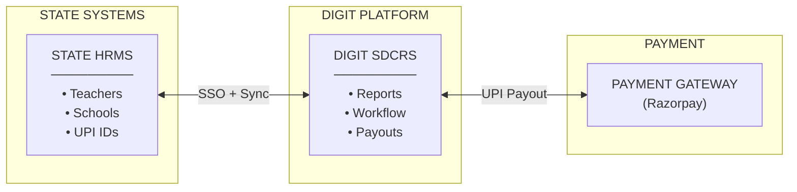
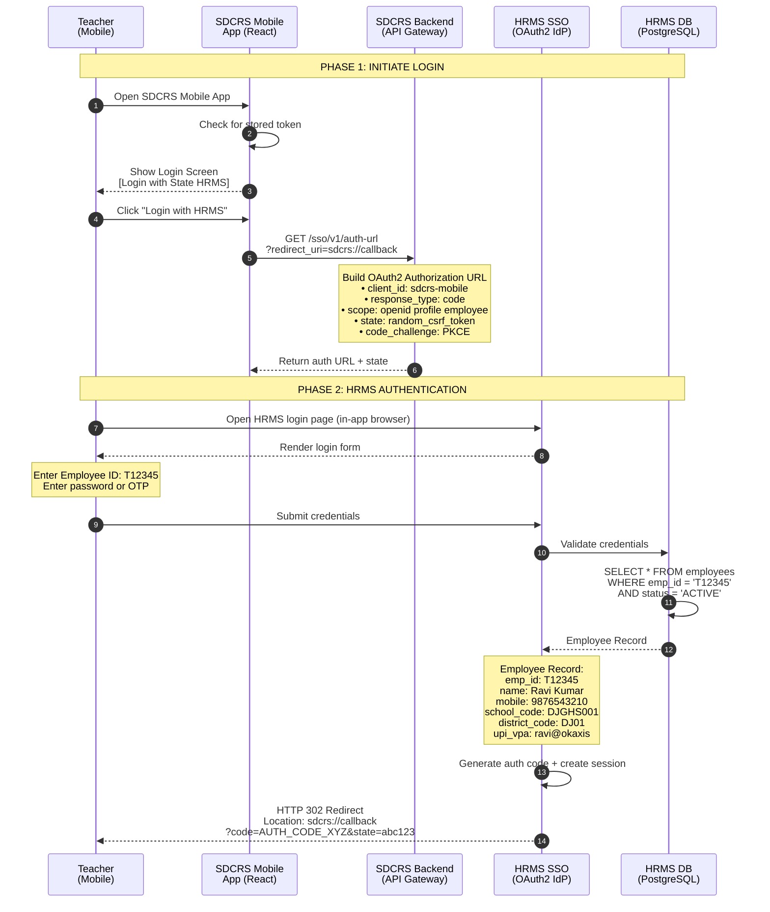
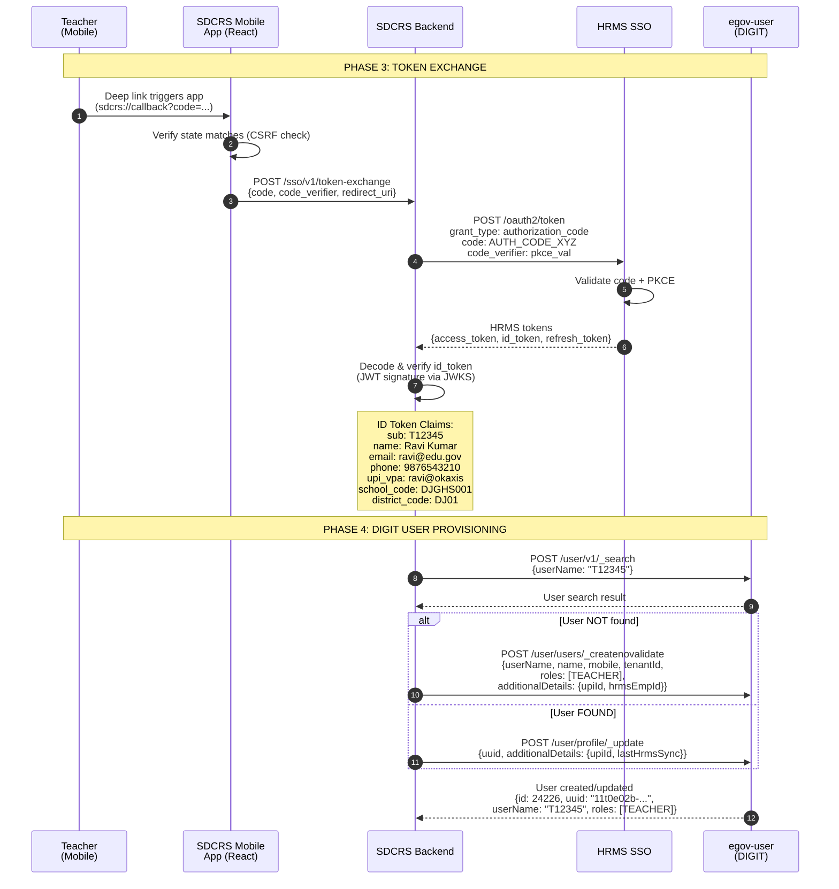
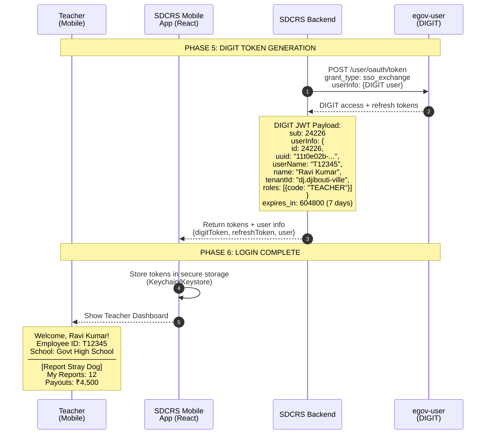
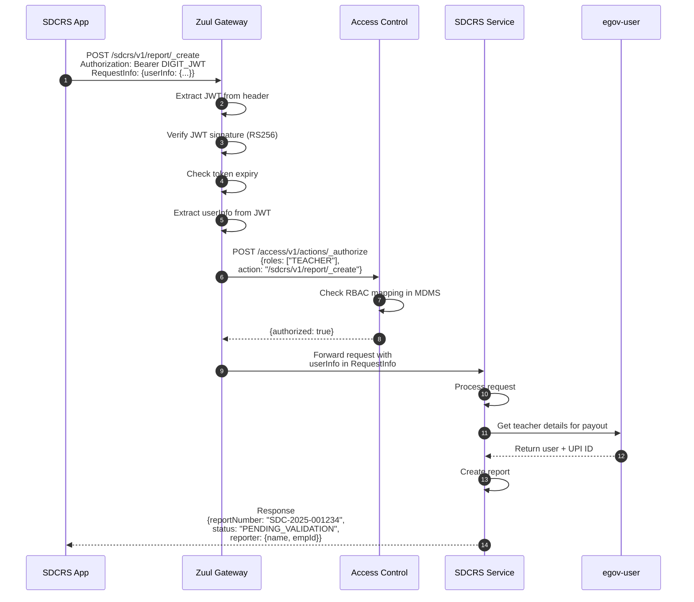
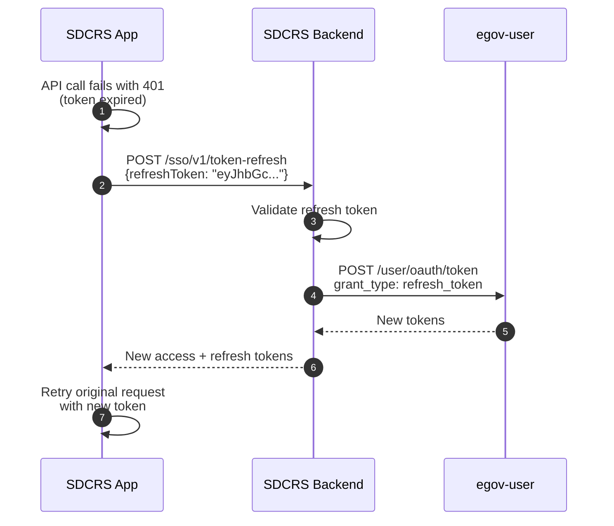
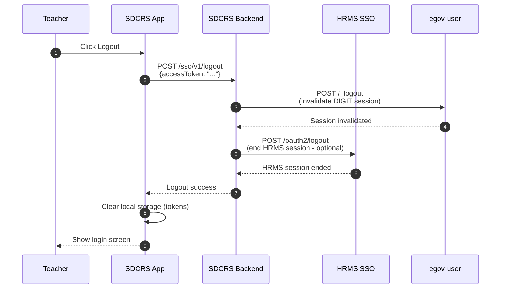
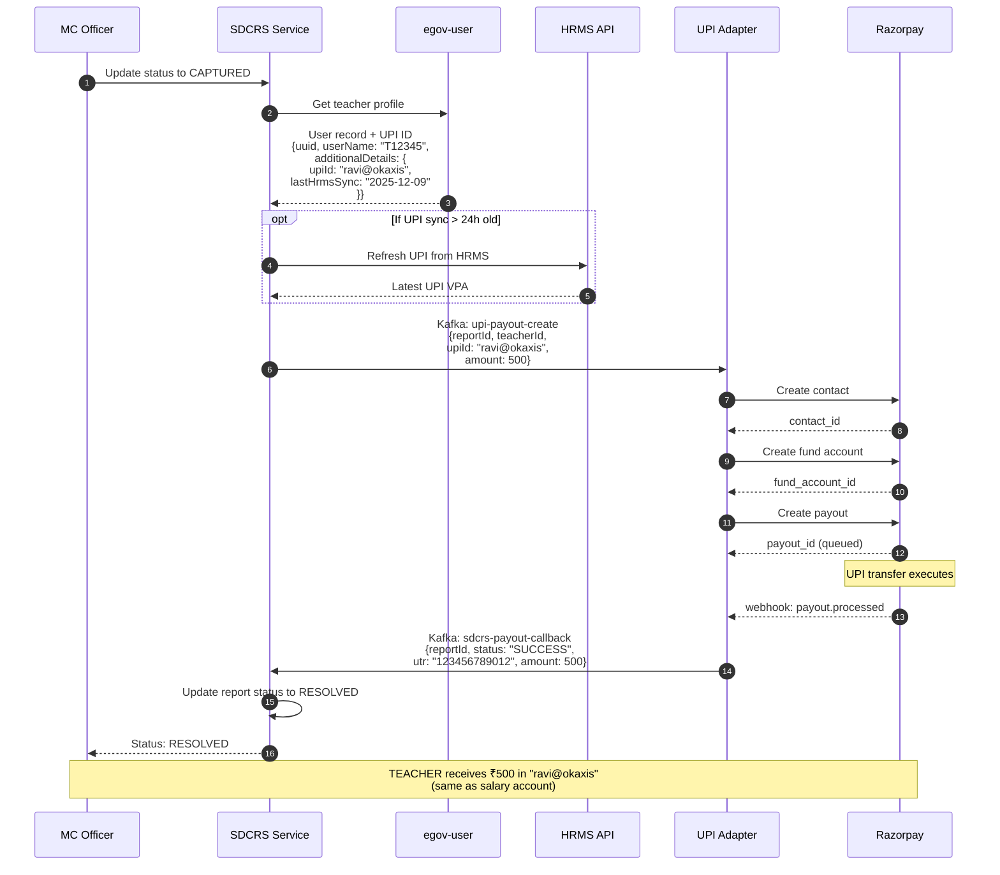
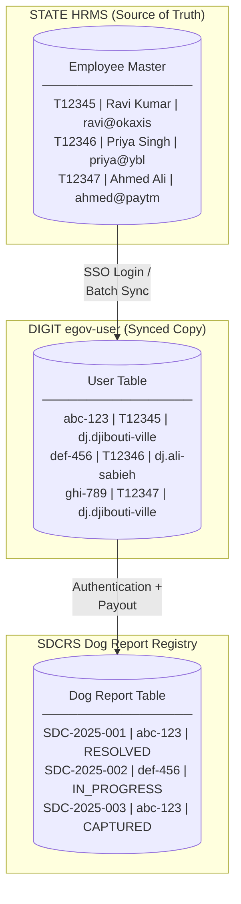
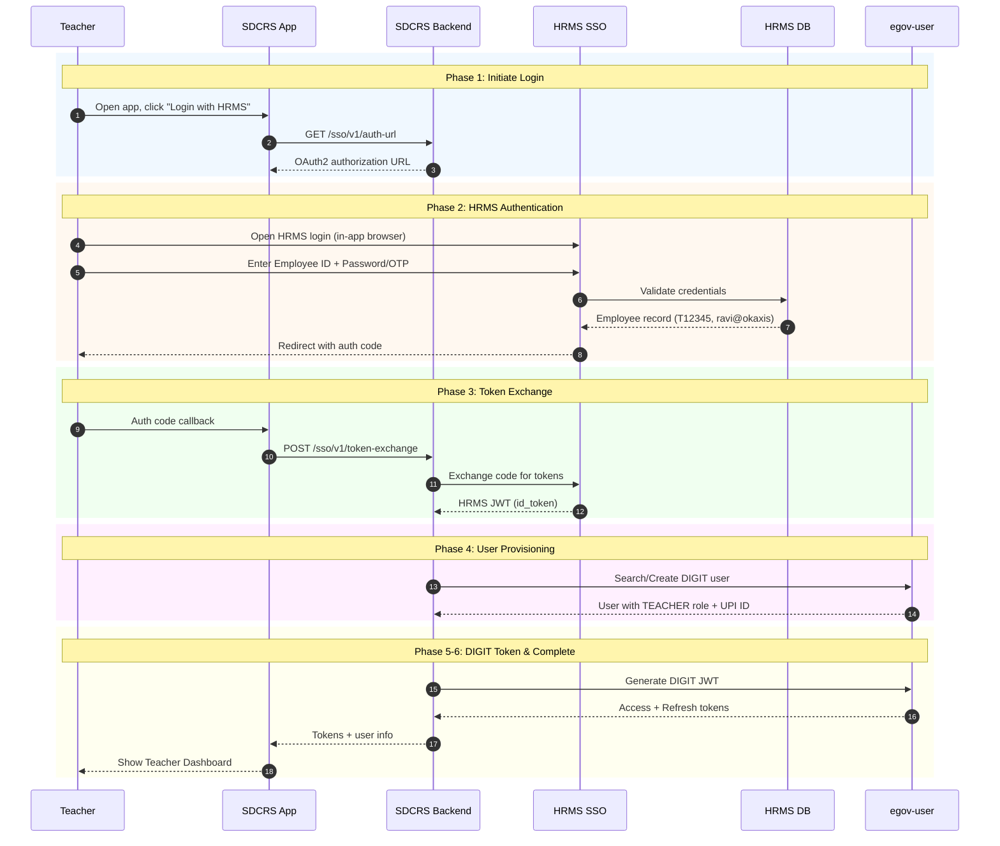

# HRMS-SSO-DIGIT Integration

## Overview

This document details the Single Sign-On (SSO) integration between the State HRMS (Human Resource Management System) and DIGIT platform for the Stray Dog Capture & Reporting System (SDCRS).

**Key Principle**: Teachers authenticate using their existing State HRMS credentials. No separate SDCRS registration is required. UPI payment details are sourced directly from HRMS salary records.

---

## Architecture Context



**HRMS is the SOURCE OF TRUTH for:**
- Teacher identity (Employee ID, Name, Mobile)
- School/District assignment
- UPI VPA for salary disbursement (reused for SDCRS payouts)
- Employment status (Active/Inactive/Transferred)

---

## Sequence Diagram: Teacher Login Flow

### Phase 1 & 2: Initiate Login & HRMS Authentication



### Phase 3 & 4: Token Exchange & User Provisioning



### Phase 5 & 6: DIGIT Token Generation & Login Complete



---

## Sequence Diagram: Authenticated API Call Flow



---

## Sequence Diagram: Token Refresh Flow



---

## Sequence Diagram: Logout Flow



---

## Sequence Diagram: Payout with HRMS-Synced UPI



---

## Data Flow Summary



---

## Complete Login Flow (Combined View)



---

## Configuration Requirements

### 1. HRMS SSO Configuration (MDMS)

**File**: `data/dj/SSO-CONFIG/HrmsIntegration.json`

```json
{
  "tenantId": "dj",
  "moduleName": "SSO-CONFIG",
  "HrmsIntegration": [
    {
      "provider": "STATE_HRMS",
      "enabled": true,
      "oauth2": {
        "issuer": "https://hrms.state.gov.in",
        "authorizationEndpoint": "https://hrms.state.gov.in/oauth2/authorize",
        "tokenEndpoint": "https://hrms.state.gov.in/oauth2/token",
        "userInfoEndpoint": "https://hrms.state.gov.in/oauth2/userinfo",
        "jwksUri": "https://hrms.state.gov.in/.well-known/jwks.json",
        "clientId": "sdcrs-mobile",
        "scopes": ["openid", "profile", "employee"],
        "pkceEnabled": true
      },
      "fieldMapping": {
        "sub": "userName",
        "name": "name",
        "phone": "mobileNumber",
        "email": "emailId",
        "emp_id": "additionalDetails.hrmsEmpId",
        "upi_vpa": "additionalDetails.upiId",
        "school_code": "additionalDetails.schoolCode",
        "designation": "additionalDetails.designation",
        "district_code": "tenantMapping"
      },
      "districtToTenantMapping": {
        "DJ01": "dj.djibouti-ville",
        "DJ02": "dj.ali-sabieh",
        "DJ03": "dj.dikhil",
        "DJ04": "dj.tadjourah",
        "DJ05": "dj.obock",
        "DJ06": "dj.arta"
      },
      "defaultRole": "TEACHER",
      "tokenValidity": {
        "accessTokenMinutes": 10080,
        "refreshTokenMinutes": 20160
      }
    }
  ]
}
```

### 2. Environment Variables

```bash
# HRMS SSO Integration
HRMS_SSO_CLIENT_ID=sdcrs-mobile
HRMS_SSO_CLIENT_SECRET=<secret_from_hrms_admin>
HRMS_SSO_ISSUER=https://hrms.state.gov.in

# PKCE code verifier storage (Redis)
REDIS_HOST=redis.backbone.svc.cluster.local
REDIS_PORT=6379
```

### 3. Access Control (MDMS)

**File**: `data/dj/ACCESSCONTROL-ROLES/roles.json` (add TEACHER role)

```json
{
  "code": "TEACHER",
  "name": "Teacher",
  "description": "Government school teacher - can report stray dogs",
  "labelKey": "ACCESSCONTROL_ROLES_TEACHER"
}
```

**File**: `data/dj/ACCESSCONTROL-ROLEACTIONS/roleactions.json` (teacher permissions)

```json
{
  "rolecode": "TEACHER",
  "actionid": 2101,
  "actioncode": "sdcrs-report-create",
  "tenantId": "dj"
}
```

---

## Security Considerations

| Aspect | Implementation |
|--------|----------------|
| **PKCE** | Mandatory for mobile app OAuth2 flow |
| **State Parameter** | CSRF protection during redirect |
| **Token Storage** | iOS Keychain / Android Keystore |
| **JWT Validation** | RS256 signature via JWKS endpoint |
| **Token Refresh** | Silent refresh before expiry |
| **Logout** | Invalidate both DIGIT and HRMS sessions |
| **UPI Validation** | Cross-check with HRMS before payout |

---

## Error Handling

| Scenario | User Experience |
|----------|-----------------|
| HRMS unavailable | Show error: "State HRMS is temporarily unavailable. Please try again later." |
| Invalid credentials | Show HRMS error message |
| Employee not found | "Your Employee ID is not registered in HRMS. Contact your school administrator." |
| Inactive employee | "Your HRMS account is inactive. Contact HR department." |
| Token expired | Silent refresh, if fails redirect to login |
| Network error | "Check your internet connection and try again." |

---

## Implementation Checklist

- [ ] Create SSO Adapter service endpoints
- [ ] Configure HRMS OAuth2 client credentials
- [ ] Set up PKCE code verifier storage (Redis)
- [ ] Implement JWT validation via JWKS
- [ ] Create user provisioning logic (create/update)
- [ ] Configure field mappings in MDMS
- [ ] Add district-to-tenant mapping
- [ ] Update frontend for SSO redirect flow
- [ ] Implement token refresh logic
- [ ] Add logout flow (both sessions)
- [ ] Set up monitoring for SSO failures
- [ ] Document rollback procedure

---

*Document Version: 1.1*
*Created: December 2025*
*Updated: Converted to Mermaid diagrams*
*Status: Design Complete*
